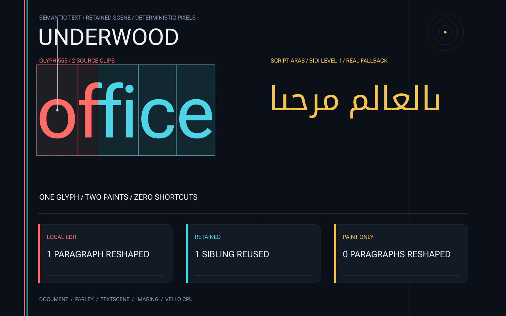

# Underwood

Underwood is a renderer- and toolkit-independent document composition and
editing platform for Rust.

It owns semantic documents, stable positions, layered annotations, computed
style, projection, incremental flow, transactions, inline objects, semantic
mapping, and renderer-neutral prepared text scenes. Parley owns text shaping
physics. Overstory is the flagship experience layer.

> Parley shapes the text. Underwood makes it a document. Overstory makes it an
> experience.

## Current status

Underwood has completed its executable-constitution bootstrap and is executing
the first semantic-to-scene campaign. The complete architecture is
[specified in the handover](UNDERWOOD_HANDOVER.md). Design-0002 approved the
first pre-stable public slice and its exact dependency fence: `underwood` owns
the `no_std + alloc` document, flow, and scene path, while
`underwood_parley` owns adaptation to pinned Parley Core.

The five mandatory foundation records are accepted:

- Charter-000: spearhead, proof, and stewardship;
- ADR-0001: position and canonical storage;
- ADR-0002: resumable flow and virtual extents;
- ADR-0003: text-data provisioning and identity;
- ADR-0004: the Parley boundary and contingency.

The external `examples/headless` crate now exercises real mixed-script shaping,
source and semantic observations, editing, and retained-work assertions through
public APIs only. Earlier synthetic wind tunnels remain research evidence, not
product benchmarks or substitutes for this permanent path.

The external `examples/visual-proof` crate lowers that real scene through
`imaging` and `imaging_vello_cpu` into a deterministic poster snapshot. Its
typography, diagnostics, and displayed work counters all come from public
Underwood output.



Product performance lives in `benches/semantic-scene` and measures those same
public crates. Pre-product hypothesis implementations live under
`experiments/` and are explicitly barred from product performance claims.

The machine-readable [proof ledger](docs/proof/ledger.tsv) is authoritative for
capability status.

## Repository workflow

Read, in order:

1. [the architectural handover](UNDERWOOD_HANDOVER.md);
2. [the agent constitution](AGENTS.md);
3. [the executable constitution](docs/CONSTITUTION.md);
4. [the governance workflow](docs/governance/README.md).

Find ready work with:

```sh
bd prime
bd ready
```

Validate the bootstrap with:

```sh
cargo fmt --all --check
taplo fmt --check --diff
cargo clippy --workspace --all-targets --all-features --locked -- -D warnings
cargo test --workspace --all-features --locked
RUSTDOCFLAGS="-D warnings" cargo doc --workspace --all-features --no-deps --locked
cargo xtask check
typos
bd lint --status all
bd dep cycles
cargo run --profile wind-tunnel -p underwood_semantic_scene_benchmark
```

The workspace MSRV is Rust 1.92. The bootstrap CI stable toolchain is Rust
1.96.

## License

Licensed under either Apache-2.0 or MIT at your option.
