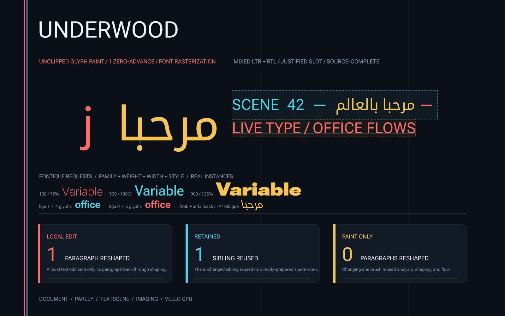

# Underwood

Underwood is a renderer- and toolkit-independent document composition and
editing platform for Rust.

It owns semantic documents, stable positions, layered annotations, computed
style, projection, incremental flow, transactions, inline objects, semantic
mapping, and renderer-neutral prepared text scenes. Parley owns text shaping
physics. Overstory is the flagship experience layer.

> Parley shapes the text. Underwood makes it a document. Overstory makes it an
> experience.

## Current status

Underwood has completed its executable constitution, first semantic-to-scene
slice, computed inline-style spine, Fontique-backed font requests, retained
Parley Core `ShapedText`, Parley-backed paragraph formation, renderer-owned
glyph paint with explicit source ownership, CPU visual proof, exact cluster
interaction, and revision-bound
multi-selection transactions. A generated-source IME composition epoch and
revisioned editable-surface query layer now execute against the same retained
Parley geometry for both event-feed and host-driven protocol shapes. Retained
`TextBlock`s now give labels a borrowed-style, single-paragraph façade over
that same engine; explicit min/max/constrained formation reports exact size
and baselines, while coordinated budgets and release keep geometry and Parley
physics caches bounded. The complete architecture is
[specified in the handover](UNDERWOOD_HANDOVER.md). Design-0002 approved the
first pre-stable public slice and its exact dependency fence: `underwood` owns
the `no_std + alloc` document, flow, and scene path, while `underwood_parley`
owns adaptation to pinned Parley Core.

The five mandatory foundation records are accepted:

- Charter-000: spearhead, proof, and stewardship;
- ADR-0001: position and canonical storage;
- ADR-0002: resumable flow and virtual extents;
- ADR-0003: text-data provisioning and identity;
- ADR-0004: the Parley boundary and contingency.

The external `examples/headless` crate now exercises real mixed-script shaping,
Fontique family/attribute matching and configured fallback, source and semantic
observations, editing, and retained-work assertions through public APIs only.
Fontique owns matching, coverage, fallback, and synthesis; Underwood owns the
computed request, invalidation, and portable resolved evidence. Earlier
synthetic wind tunnels remain research evidence, not product benchmarks or
substitutes for this permanent path.

The external `examples/visual-proof` crate lowers that real scene through
`imaging` and `imaging_vello_cpu` into a deterministic poster snapshot. Its
typography, diagnostics, and displayed work counters all come from public
Underwood output.



The external `examples/showcase` host presents one real semantic heading/body
document in a native resizable window. Resizing drives retained finite-width
formation; Space performs a local edit; `P` changes paint without repeating
text physics; `A` animates the Roboto Flex weight axis; and `G` reveals legal
line and baseline evidence. Run the optimized meeting demo with:

```sh
cargo run --release -p underwood_showcase
```

The external `underwood_pdf` adapter lowers that same public prepared-scene
contract through Krilla without moving PDF policy into the foundational
crates. Its proof writes a deterministic one-page mixed Latin/Arabic specimen:

```sh
cargo run --release -p underwood_pdf_proof
```

The PDF preserves prepared visual glyph placement, solid paint, transforms,
clips, real glyph Unicode, RTL run structure, and single-carrier Unicode for
partial-painted glyphs. Mixed-direction selection and copy remain
viewer-dependent—macOS Preview also misorders mixed Arabic in Chrome and
Apple-native Quartz reference PDFs—so this proof does not claim universal
logical extraction, tagged PDF, or PDF/UA.

The deterministic IME compatibility proof starts with two independent scene
selections, reports their explicit normalization to one native marked region,
shapes Arabic preedit without publishing the document, answers synchronous
UTF-16/text/geometry/hit queries from the exact same epoch, then demonstrates
zero-work cancel and single-publication commit:

```sh
cargo run -p underwood_ime_compat_experiment
```

Product performance lives in `benches/semantic-scene` and measures those same
public crates. The label-scale `benches/labels` wind tunnel proves stable,
identical, localized-edit, intrinsic/constrained, release, and budget-churn
behavior through `TextBlock` and public diagnostics. Pre-product hypothesis
implementations live under `experiments/` and are explicitly barred from
product performance claims.

The machine-readable [proof ledger](docs/proof/ledger.tsv) is authoritative for
capability status.

## Repository workflow

Read, in order:

1. [the architectural handover](UNDERWOOD_HANDOVER.md);
2. [the agent constitution](AGENTS.md);
3. [the executable constitution](docs/CONSTITUTION.md);
4. [the governance workflow](docs/governance/README.md).

Find ready work with:

```sh
bd prime
bd ready
```

Validate the bootstrap with:

```sh
cargo fmt --all --check
taplo fmt --check --diff
cargo clippy --workspace --all-targets --all-features --locked -- -D warnings
cargo test --workspace --all-features --locked
RUSTDOCFLAGS="-D warnings" cargo doc --workspace --all-features --no-deps --locked
cargo xtask check
typos
bd lint --status all
bd dep cycles
cargo run --profile wind-tunnel -p underwood_semantic_scene_benchmark
cargo run --profile wind-tunnel -p underwood_label_benchmark
```

Underwood's production crates and non-rendering workspace members have an MSRV
of Rust 1.88. The native showcase, visual proof, and PDF adapter/proof require
Rust 1.92 because their published renderer dependencies declare that MSRV.
Stable CI checks the complete workspace with Rust 1.96.

## License

Licensed under either Apache-2.0 or MIT at your option.
