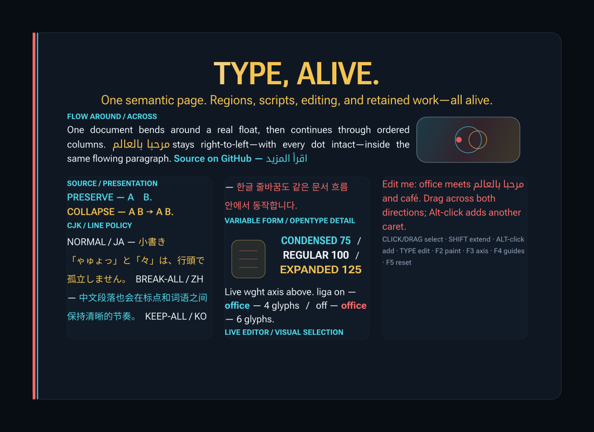

<!-- Copyright 2026 the Underwood Authors -->
<!-- SPDX-License-Identifier: Apache-2.0 OR MIT -->

# Underwood live showcase

This external app presents one real semantic Underwood document in a native,
resizable window. Window width becomes the document's finite inline constraint;
Underwood performs retained paragraph formation; `imaging` records the resulting
portable `TextScene`; `imaging_vello_cpu` rasterizes it; and `softbuffer` only
presents the final pixels.

Run it from the repository root:

```sh
cargo run --release -p underwood_showcase
```

The page is one continuous document, not a stack of separately positioned
specimens. Its first deliberately undersized region rejects the measured title
line, the hero text flows around a real padded right float, and wide windows
continue through three equal bounded columns. Medium windows use two columns and
narrow windows use one region. The second column contains a real exclusion; the
small gold card is painted inside a larger obstacle, so its visible gutter is
also part of line formation. A separate off-page continuation region keeps
ordinary content growth from turning finite visible columns into a fatal layout
error; if reached, the host reports the document as clipped.

Controls are shown in the window. Click to place an exact caret, drag for a
visual selection, Shift-click to extend it, and Alt-click to add an independent
caret. Typing, Enter, Backspace, Delete, and the left/right arrow keys execute
revision-checked edits and movement. Native Winit IME preedit is projected
without mutating the document and commits once. `F2` changes paint, `F3`
animates the variable-font weight axis, `F4` cycles flow slots, line boxes,
fragments, glyphs, and semantic geometry, and `F5` restores the complete
authored document. Guided modes add exact invalidation causes, slot/retry
counts, retained scene/cache capacity, and scratch growth to the title; the
normal title always reports preparation and rendering time separately.

The mixed English/Arabic “Source on GitHub” leaf is also actionable. Hover
uses exact shaped-cluster hits to change its paint and request the native link
pointer; press and release on the same semantic node sends a URL-shaped action
to the host. The proof host acknowledges that request in the title bar but does
not launch a browser. Moving beyond the click threshold transfers the original
cluster position into visual-selection policy, so dragging from the link selects
its wrapped Latin and Arabic text instead of activating it.

The editor paragraph deliberately mixes Latin, Arabic, an `ffi` ligature, and
a decomposed combining sequence. Selection geometry follows visual bidi order
without flattening disjoint logical ranges; independent carets publish one
atomic replacement transaction. The title keeps the last meaningful work
observation visible while reporting current preparation and rendering times
separately.

The same document also exercises accepted-slot adjustment through Underwood's
public paragraph styles. The variable-font hero and deck are centered, the
mixed English/Arabic body expands eligible Western spaces on soft-wrapped
lines, and the width-axis specimen is centered. Paint, hit testing, selection,
composition, and semantic geometry consume those adjusted `TextScene`
coordinates; the app does not reposition text in its renderer.

The source/presentation specimen contrasts preserved authored spacing with a
collapsed space-tab-newline run. Collapse changes the presentation stream
without discarding source bytes: every authored byte remains selectable. The
CJK specimen executes `normal` Japanese, `break-all` Chinese, and `keep-all`
Korean policy with the complex-script analysis data enabled. Three small
proof-only regional subsets are derived from the official Noto CJK 2.004
release, so Japanese, Simplified Chinese, and Korean do not share an accidental
regional Han design. Exact source paths, commit, hashes, and license are recorded in
[the asset provenance](assets/fonts/README.md).

This proof does not implement text transformation (`uppercase`, `lowercase`,
`capitalize`, or locale-tailored casing), trimming, hanging punctuation,
kinsoku compression, Japanese inter-character justification, Arabic kashida
generation, or dictionary behavior beyond the enabled Parley Engine data.
Western-space justification is the only expansion policy demonstrated here.
Those limits are intentional and are not hidden by the presentation.

The crate is deliberately outside the production crates. It does not make
Underwood depend on a window toolkit or renderer.

Every visible glyph comes from one `DocumentSnapshot`. Heading roles are
preserved semantically, while this app deliberately keeps role-based block
styling, scrolling, and native accessibility projection outside the proof. A
viewport too short for the complete flow is reported as `CLIPPED` in the window
title instead of silently implying that scrolling already exists.

The same bundled-font content has a deterministic headless rendering:

```sh
cargo run --release -p underwood_showcase -- --write-snapshot
```


